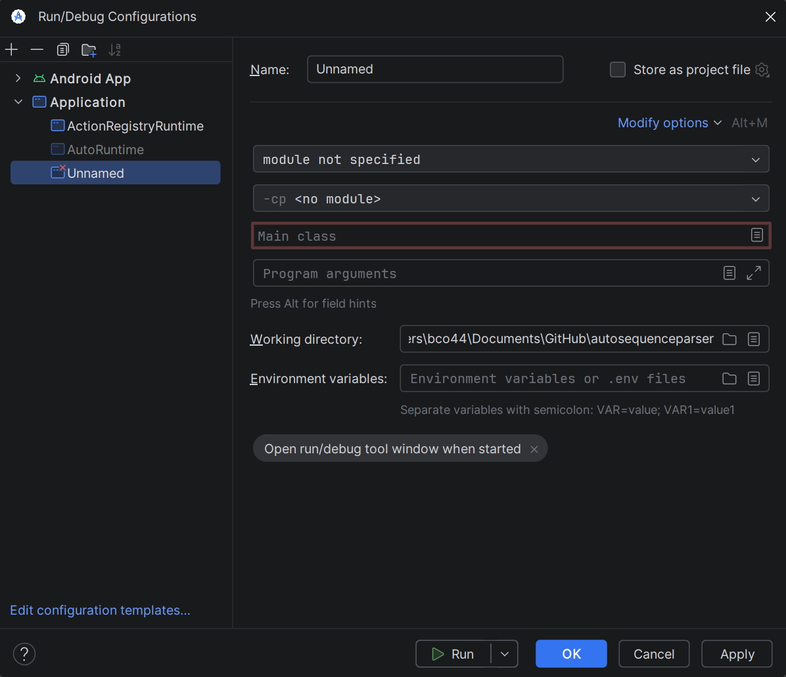

# FTC Instant Auto (Prototype)

A Java-based architecture for FTC robots designed to parse text files into AUTONOMOUS sequences (using RoadRunner Actions) and robot configurations. This system replaces hard-coded autonomous code with a decoupled, registry-based system, allowing for rapid iteration and configuration without code redeploys.

## Key Features

- **Text-Based Configuration**: Manage robot constants, goal positions, and intake settings through simple .txt files.
- **Registry-Based Actions**: Decoupled Mini Actions (base commands) and Big Actions (composed sequences) managed via a central registry.
- **Validation & Dry Run**: A robust parser that validates syntax, types, and parameter counts during initialization, reporting errors via Telemetry to prevent OpMode crashes.
- **Hierarchical Loading**: Supports base configurations (e.g., GeneralRobotSettings) with autonomous-specific overrides.
- **Comment Support**: Clean text files using // comment style.

## Architecture

The project is divided into three main layers:

### 1. Definition Layer
- **MetaField<T>**: Interface for complex data types (e.g., Pose2d, IntakeSetting) that defines parameter types and identifiers.
- **MetaAction**: Interface for creating executable Actions from parameterized strings.
  - Mini Action: class for making registerable primitive actions (e.g., GO.TO.POSE2D).
  - Big Action: class for making registerable composite actions (e.g., BLUE.LOAD.INTAKE) parsed from MetaActionSettings.

### 2. Registry Layer
- **MetaFieldRegistry**: Maps field names (e.g., RedGoalPose) to specific data types and default values.
- **MetaActionRegistry**: A factory and storage for both primitive Mini Actions and user-defined Big Actions.

### 3. Parser Engine
- **ConfigParser**: Handles file I/O, string cleaning, and strict type validation (e.g., ensuring boolean values aren't mistakenly parsed from numbers).
- **AutoParser**: Orchestrates the loading of the robot's state, scanning for [ACTIVE] autonomous routines and validating required fields like Starting.

---

## HOW TO

### 1. How to Clone this Project
1. Install Git on your computer.
2. Open a terminal or command prompt.
3. Type `git clone https://github.com/bco44/autosequenceparser.git` and press enter.
- Note: Using GitHub Desktop will also work

### 2. How to Open in Android Studio
1. Open Android Studio.
2. Select "Open" from the welcome screen or File menu.
3. Navigate to the folder where you cloned the project.
4. Select the root folder and wait for the project to load and sync.

### 3. How to Use Test Programs
To run a program, find the file, right-click the green arrow next to the class or main method, and select "Run".

If you are first time running them:
  - Click on the Run/Debug configuration tab on the left of the green arrow
  - Click on the "+" to add new configuration on top left.
  - Select "Application".
  - Change "cp: <no modules>" to "autosequenceparser.purejava.main" in the menu.
  - Set "main class" to the program you want to run.

| Program | File Path | What it does |
| :--- | :--- | :--- |
| **TeleOpRuntime** | pureJava/src/main/java/com/example/purejava/TeleOpRuntime.java | Tests the configuration parser. It reads GeneralRobotSettings and prints values to verify they are loaded correctly. |
| **RegistryRuntime** | pureJava/src/main/java/com/example/purejava/RegistryRuntime.java | Tests the action registry. It loads MetaActionSettings and lists all registered actions to verify sequences. |
| **AutoRuntime** | pureJava/src/main/java/com/example/purejava/AutoRuntime.java | The main autonomous entry point. It scans for [ACTIVE] files, lets you pick one, validates it, and runs the sequence. |

### 4. Changing GeneralRobotSettings
File: pureJava/src/main/java/com/example/purejava/textfiles/GeneralRobotSettings

- **DO**:
  - Use the format `FieldName = Value` (e.g., `maxPower = 0.8`).
  - Use `pose2d(x, y, h)` for position fields.
  - Use `//` at the start of a line or after code to add comments.
- **DO NOT**:
  - Use numbers like `1` or `0` for true/false (must be `true` or `false`).
  - Remove the `=` sign.
  - Use field names that are not in the registry.

### 5. Changing MetaActionSettings
File: pureJava/src/main/java/com/example/purejava/textfiles/MetaActionSettings

- **DO**:
  - Define sequences using `NAME={ Action1, Action2 }`.
  - Use commas to separate multiple actions.
  - Put actions on new lines for readability.
- **DO NOT**:
  - Forget the closing `}`.
  - Use actions inside the curly braces that are not registered.

### 6. Managing Autonomous Pathing Files
Directory: pureJava/src/main/java/com/example/purejava/textfiles/

- **DO**:
  - Start filenames with `[ACTIVE]` (e.g., `[ACTIVE]RedSideAuto`).
  - Always include a `Starting=POSITION` field (e.g., `Starting=RED.FAR`).
  - Use `Title=My Name` to give your auto a label.
- **DO NOT**:
  - Delete all `[ACTIVE]` files (at least one must exist).
  - Forget the `Starting` field, as the program will trigger a critical error.

### 7. Adding Fields to MetaFieldRegistry
File: pureJava/src/main/java/com/example/purejava/configs/MetaFieldRegistry.java (Line 31)

- **DO**:
  - Add `registerField("YourName", Type.class, defaultValue);` inside the static block.
  - Use standard types like `Double.class`, `Boolean.class`, or `String.class`.
- **DO NOT**:
  - Register the same field name twice.

### 8. Adding Actions to MetaActionRegistry
File: pureJava/src/main/java/com/example/purejava/actions/MetaActionRegistry.java (Line 21)

It is possible to manually register additional mini and hard-coded big actions through code.

- **To add a MiniAction**: Add `register(new MiniAction("NAME", params -> ...));` in the static block.
- **To add a hard-coded BigAction**: Add `register(new BigAction("NAME", listOfSubActionStrings, false));` in the static block.
- **DO NOT**:
  - Use duplicate names for actions.

---

## Requirements
- Java 8+
- Android Studio (Panda 2 version advised)
