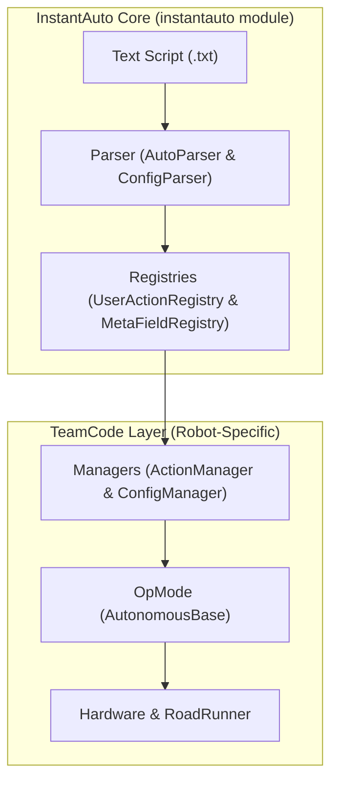

# Developer Guide

The Developer Guide covers the internal architecture of InstantAuto and how to contribute to the project.

---

## Navigation

*   [Introduction](index.md)
*   [Parser](parser.md)
*   [Action System](action-system.md)
*   [Configuration](configuration.md)
*   [Execution: Accessing & Updating Fields](execution-accessing-updating-fields.md)
*   [Execution: Actions & RoadRunner Adaptation](execution-actions-roadrunner-adaptation.md)
*   [Execution: Autonomous Execution](execution-rr-auto.md)
*   [Contributing](contributing.md)

---

## InstantAuto Framework

InstantAuto is a high-level, text-based autonomous framework for FTC robots, built on top of [Roadrunner 1.0](https://rr.brott.dev/docs/v1-0/introduction/). It allows teams to write and iterate on autonomous paths using simple text files without needing to recompile code for every change.

### Core Concepts

The framework bridges the gap between high-level path descriptions and low-level hardware control through a modular registry-based architecture.

### How it Works

1.  **Text Scripts**: Autonomous routines are defined in plain text files (e.g., `ACTIVEBlueAuto.txt`).
2.  **Parser**: An interpreter (`AutoParser` & `ConfigParser`) that reads the text file and resolves strings into functional components.
3.  **Action & Config Registry**: Centralized stores (`UserActionRegistry` and `MetaFieldRegistry`) that define the "vocabulary" of the robot—what it knows and what it can do.
4.  **Action/Config Manager**: Java-side classes (`ActionManager` and `ConfigManager`) that bind hardware-specific logic (like RoadRunner drive commands or servo movements) to the registries.
5.  **Autonomous/TeleOp Application**: The final `OpMode` that uses the parser to generate and execute an action sequence.

---

## System Architecture

The following flowchart illustrates the lifecycle of an InstantAuto routine, from the text script to hardware execution:

### Module Separation

| Module | Responsibility | Dependencies |
|--------|----------------|--------------|
| `instantauto` | Core parsing, registries, action interfaces | **None** (pathing-agnostic) |
| `TeamCode` | Hardware binding, RoadRunner integration, OpModes | `instantauto`, RoadRunner 1.0, FTC SDK |
| `MeepMeepTestbed` | Simulation using same text files | `instantauto`, MeepMeep |

> **Key Design**: The `instantauto` module has **zero dependencies** on RoadRunner or FTC SDK. All hardware-specific code lives in TeamCode.