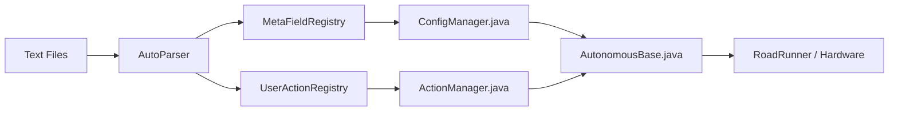

# Programmer Guide

The Programmer Guide is for developers integrating InstantAuto into an FTC SDK project. It covers the Java-side setup: registering hardware, sensors, custom actions, and RoadRunner integration.

---

## What You'll Build



---

## Prerequisites

- FTC SDK project with RoadRunner 1.0
- `instantauto` module as dependency (see [Getting Started](../user/getting-started.md#installation))

---

## Integration Steps

| Step | File | Purpose |
|------|------|---------|
| 1 | `ConfigManager.java` | Register variables, MetaField types, sensor suppliers, conditions |
| 2 | `ActionManager.java` | Register primitive actions (`STRAFE.TO`, `SPLINE.TO`, subsystem actions) |
| 3 | `AutonomousBase.java` | Parse text files, initialize hardware, execute actions |
| 4 | Text files | Define poses, macros, and match routines |

---

## Guide Pages

| Topic | Description |
|-------|-------------|
| [Roadrunner Integration](roadrunner.md) | `MecanumDrive` setup, trajectory fusion, `ActionUtils` |
| [Variables, Conditions & Hardware](variables-conditions.md) | `MetaFieldRegistry`, sensor suppliers, condition suppliers |
| [Subsystems](subsystems.md) | Encapsulate hardware, expose as actions |
| [Custom Actions](custom-actions.md) | Create new primitive actions with `MiniAction` |
| [Complete Example](example.md) | Full integration: Java + text files + execution flow |
| [MeepMeep Testbed](meep-meep-testbed.md) | Simulate autonomous routines in browser |

---

## Key Classes

| Class | Location | Responsibility |
|-------|----------|----------------|
| `ConfigManager` | `TeamCode/configs/` | Registers fields, types, suppliers |
| `ActionManager` | `TeamCode/action/` | Registers MiniActions, builds RR actions |
| `ActionUtils` | `TeamCode/action/` | Parameter parsing, action merging, RR adaptation |
| `AutonomousBase` | `TeamCode/opmodes/` | OpMode base class, parsing + execution |
| `Pose2d`, `IntakeSetting` | `TeamCode/configs/` | MetaField type implementations |

---

## Quick Start: Minimal Integration

### 1. ConfigManager.java
```java
public class ConfigManager {
    public static void init(OpMode opMode) {
        // Types
        MetaFieldRegistry.registerType(new Pose2d(0, 0, 0));
        MetaFieldRegistry.registerType(new IntakeSetting("", false, 0));
        
        // Fields with defaults
        MetaFieldRegistry.registerField("Starting", Pose2d.class, new Pose2d(0, 0, 0));
        MetaFieldRegistry.registerField("Title", String.class, "");
        MetaFieldRegistry.registerField("scorePose", Pose2d.class, new Pose2d(48, 24, 90));
        
        // Sensor supplier
        MetaFieldRegistry.registerField("distance", Double.class, 
            () -> opMode.hardwareMap.get(DistanceSensor.class, "dist").getDistance(DistanceUnit.CM));
        
        // Condition supplier
        UserActionRegistry.registerCondition("withinDistance", () -> 
            opMode.hardwareMap.get(DistanceSensor.class, "dist").getDistance(DistanceUnit.CM) < 10);
    }
}
```

### 2. ActionManager.java
```java
public class ActionManager {
    MecanumDrive drive;
    Telemetry telemetry;
    
    public void init(MecanumDrive drive, Telemetry telemetry) {
        this.drive = drive; this.telemetry = telemetry;
        
        UserActionRegistry.register(new MiniAction("STRAFE.TO", this::strafeToFactory));
        UserActionRegistry.register(new MiniAction("SPLINE.TO", this::splineToFactory));
        UserActionRegistry.register(new MiniAction("PRINT", p -> ActionUtils.wrap(new PrintAction(p))));
        UserActionRegistry.register(new MiniAction("WAIT", p -> {
            double[] d = ActionUtils.asDoubles(p, 1);
            return d != null ? ActionUtils.wrap(new SleepAction(d[0])) : null;
        }));
        // ... PARALLEL, RACE, HELLO.WORLD
    }
    
    private Action strafeToFactory(Object params) { ... }
    private Action splineToFactory(Object params) { ... }
}
```

### 3. AutonomousBase.java
```java
@Override
public void init() {
    ConfigManager.init(this);
    actionManager = new ActionManager();
    telemetry = new MultipleTelemetry(telemetry, FtcDashboard.getInstance().getTelemetry());

    // Phase 1: Parse configuration to get the starting pose
    autoParser.parseAutoConfig(autoFile);

    Pose2d pose;
    try {
        org.firstinspires.ftc.teamcode.configs.Pose2d pose_wrapped = (org.firstinspires.ftc.teamcode.configs.Pose2d) MetaFieldRegistry.getEntry("Starting").getValue();
        pose = pose_wrapped.getRRPose2d();
    } catch (Exception e) {
        throw new RuntimeException("Invalid Starting Pose: MUST BE POSE2D");
    }

    // Phase 2: Initialize hardware with the correct pose
    mecanumDrive = new MecanumDrive(hardwareMap, pose);
    actionManager.init(mecanumDrive, telemetry);

    // Register nested action merger for if/else blocks (must be before parseActions)
    UserActionRegistry.setActionMerger(actions -> ActionUtils.mergeNestedActions(actions, mecanumDrive));

    // Phase 3: Parse actions (now that primitives are registered by actionManager)
    autoParser.parseActions();

    //Print auto title, warning, errors...
    //telemetry.add()...
    telemetry.update();
}
    
    @Override
    public void start() {
        // Clear actions before re-parsing with merging
        actions.clear();
        List<Action> mergedActions = ActionUtils.asActions(autoParser.getActionContent(), mecanumDrive);
        if (mergedActions != null) {
            // Also merge any nested actions in top-level actions (e.g., if/else at top level)
            mergedActions = ActionUtils.mergeNestedActions(mergedActions, mecanumDrive);
            for (Action action : mergedActions) {
                actions.add(ActionUtils.adapt(action, telemetry));
            }
        }
        Actions.runBlocking(
                new RaceAction(
                        new SequentialAction(actions)
                )
        );
    }
```

---

## Next: [Roadrunner Integration →](roadrunner.md)